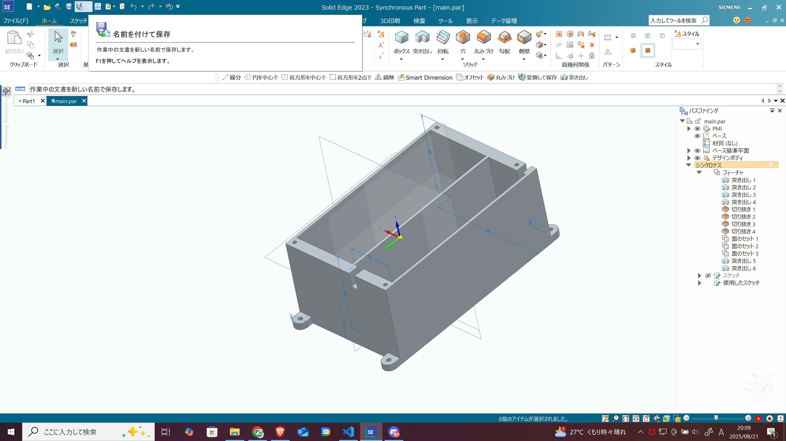
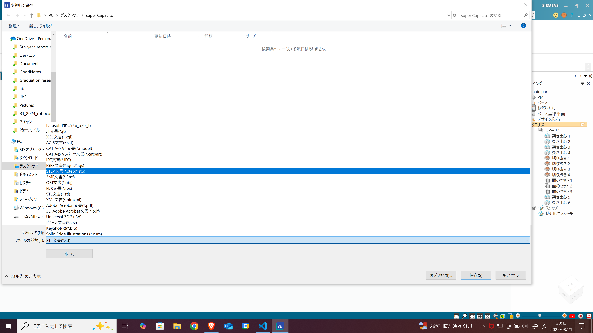
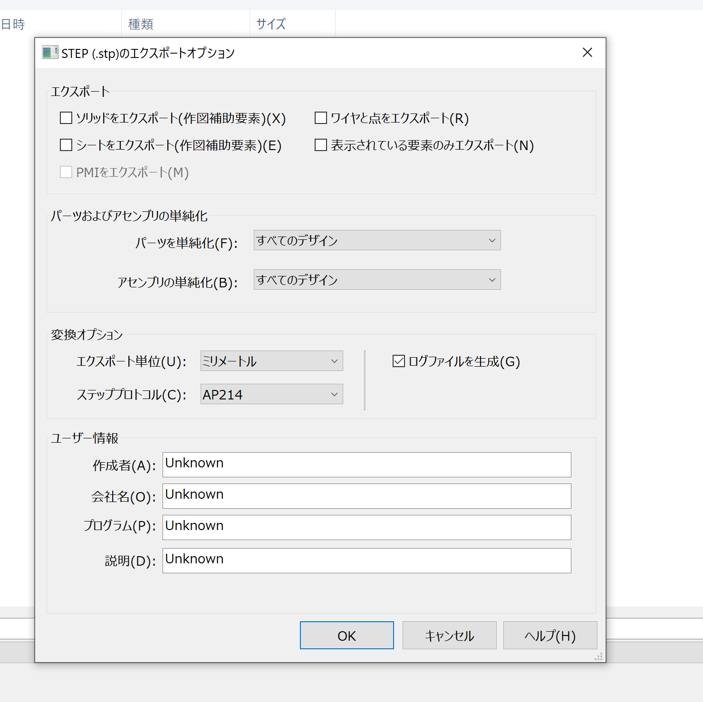

# CADでSTEPファイルを作成する方法

## STEPファイルとは？

**STEPファイル（.step または .stp）** は、
ISO 10303 規格に基づいた **3D CADデータの交換用フォーマット** です。

特徴:

* ソフトウェア間での互換性が高い
* 3D形状データを中立形式で保存可能
* 部品・アセンブリの情報を保持できる
* 製造業（機械設計・電気筐体設計）で最も広く使われる中立フォーマット

例えば、SolidWorksで設計した部品をFusion 360やCATIAで開くときに利用されます。

## 代表的なCADでのSTEPファイル作成方法
>以下情報には誤りがある場合があります

### Solid Edge

1. メニューから **「ファイル → 変換して保存」** を選択

2. **保存** をクリック

### SolidWorks

1. メニューから **「ファイル → 名前を付けて保存」** を選択
2. 保存形式のプルダウンから **「STEP AP203/214/242」** を選択
3. 必要に応じて **オプション設定（単位や精度）** を調整
4. **保存** をクリック

### Autodesk Fusion 360

1. 左上の **「ファイル → エクスポート」** を選択
2. 「ファイルタイプ」から \*\*STEPファイル（*.step, *.stp）** を選ぶ
3. 出力先フォルダを指定
4. **OK** を押すとクラウド経由で変換・ダウンロード可能

### AutoCAD (3Dモデリング)

1. **「EXPORT」コマンド** を入力
2. ファイル形式から \*\*STEP (*.stp, *.step)** を選択
3. 保存先を指定してエクスポート

### CATIA

1. **「ファイル → 変換」** をクリック
2. 出力形式として **STEP** を選択
3. **AP203 / AP214 / AP242** の規格を指定可能
4. 保存

### Autodesk Inventor

1. **「ファイル → エクスポート → CAD形式」** を選択
2. ファイルタイプで \*\*STEPファイル（*.stp, *.step）** を選ぶ
3. オプションで **精度・単位・アセンブリ構成** を指定
4. 保存

